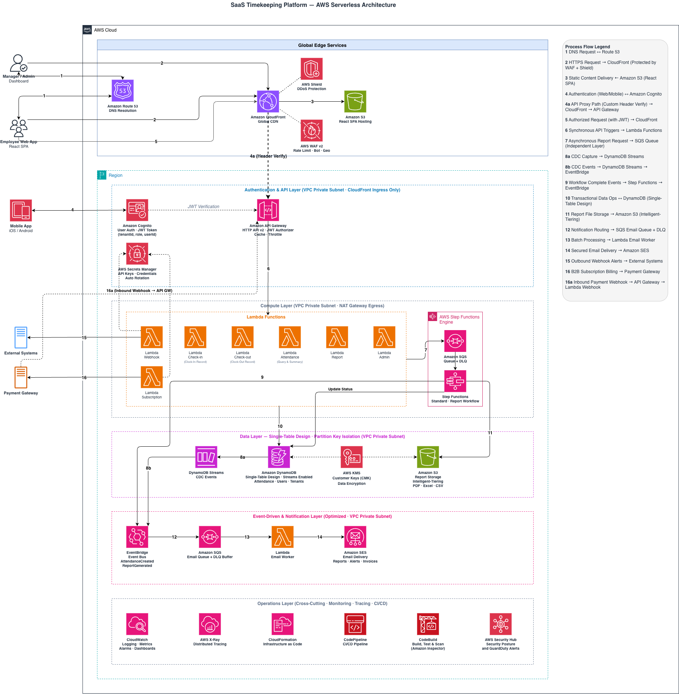

#### Tổng quan Workshop

Workshop này mang đến trải nghiệm thực hành xây dựng một **nền tảng Smart Attendance SaaS đa tenant** bằng **kiến trúc AWS Serverless** hoàn chỉnh. Trong suốt quá trình thực hiện, người tham gia sẽ triển khai và tích hợp các dịch vụ AWS cốt lõi để tạo ra một hệ thống quản lý chấm công có khả năng mở rộng, bảo mật và tối ưu chi phí cho nhiều tổ chức khác nhau.

Giải pháp được xây dựng theo các nguyên tắc thiết kế Cloud-native hiện đại, cho phép hệ thống tự động mở rộng theo nhu cầu sử dụng, đảm bảo tính sẵn sàng cao, đơn giản hóa việc quản lý hạ tầng và tối ưu chi phí vận hành thông qua các dịch vụ được AWS quản lý.

#### Kiến trúc hệ thống

Trong workshop này, bạn sẽ xây dựng và triển khai một giải pháp **Smart Attendance SaaS** hoàn chỉnh, bao gồm các dịch vụ AWS sau:

+ **AWS SAM (Serverless Application Model)** để triển khai hạ tầng theo mô hình Infrastructure as Code (IaC).
+ **Amazon Cognito User Pool** để xác thực người dùng và phân quyền trong môi trường đa tenant.
+ **Amazon API Gateway** để cung cấp các REST API bảo mật.
+ **AWS Lambda** để xử lý logic nghiệp vụ theo mô hình Serverless.
+ **Amazon DynamoDB** sử dụng mô hình **Single-Table Design** và thuộc tính **tenantId** để cô lập dữ liệu giữa các tenant.
+ **Amazon EventBridge**, **AWS Step Functions**, **Amazon SQS** và **Amazon SES** để tự động hóa quy trình tạo báo cáo bất đồng bộ và gửi email.
+ **Amazon S3** và **Amazon CloudFront** để lưu trữ và phân phối toàn cầu ứng dụng React Single Page Application (SPA).

#### Sơ đồ kiến trúc

Sơ đồ dưới đây minh họa kiến trúc tổng thể sẽ được triển khai xuyên suốt workshop.

#### Mục tiêu học tập

Sau khi hoàn thành workshop, bạn sẽ có thể:

+ Triển khai hạ tầng Serverless bằng **AWS SAM** theo các nguyên tắc tốt nhất của Infrastructure as Code (IaC).
+ Cấu hình xác thực và phân quyền bằng **Amazon Cognito** kết hợp với **JWT Authorizer** trên Amazon API Gateway.
+ Thiết kế mô hình dữ liệu **DynamoDB Single-Table** cho một ứng dụng SaaS đa tenant.
+ Xây dựng các quy trình xử lý bất đồng bộ bằng **Amazon EventBridge**, **AWS Step Functions**, **Amazon SQS** và **Amazon SES**.
+ Triển khai ứng dụng React Single Page Application trên **Amazon S3** và phân phối nội dung toàn cầu thông qua **Amazon CloudFront**.
+ Hiểu toàn bộ quy trình phát triển và triển khai một ứng dụng AWS Serverless SaaS theo định hướng Production.

#### Thời lượng dự kiến

+ **Thời gian thực hiện:** 60–90 phút.
+ **Mức độ:** Trung cấp đến nâng cao.