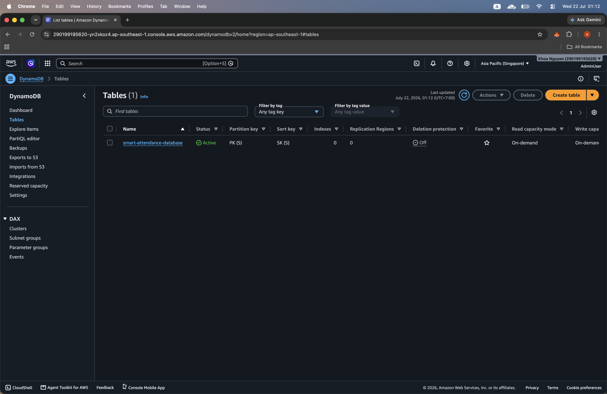
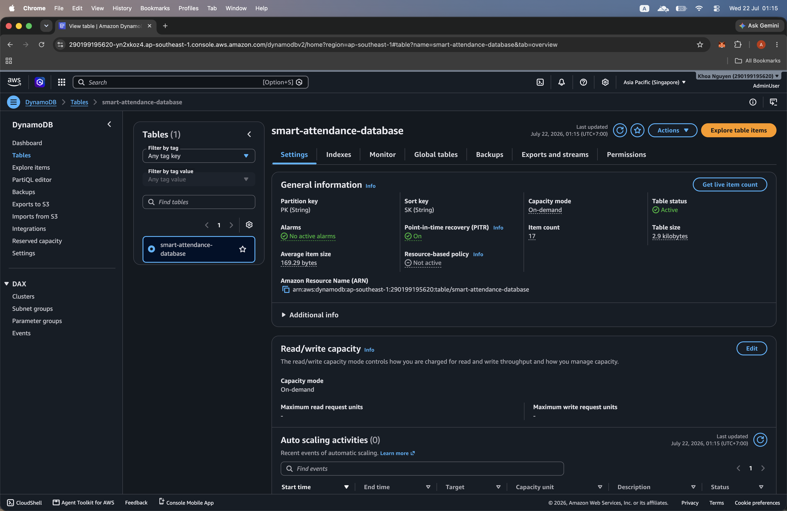
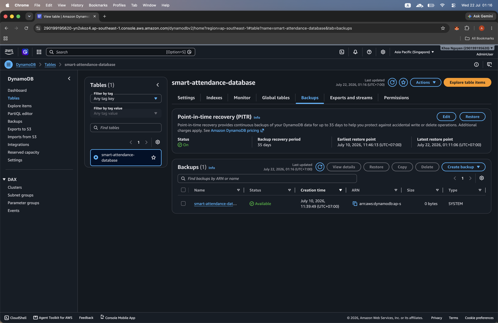
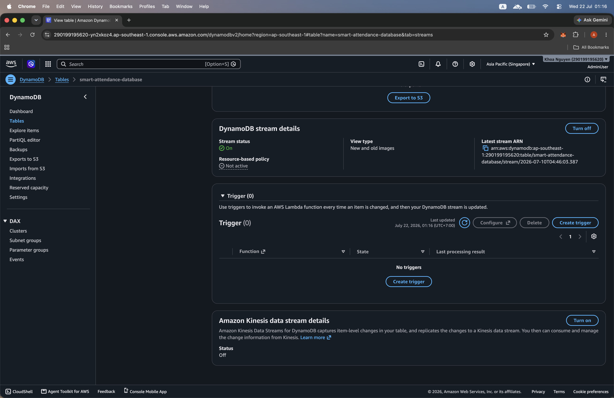

#### Thiết kế Single-Table trên DynamoDB và DynamoDB Streams CDC

Trong mô hình **SaaS đa tenant (Multi-Tenant SaaS)**, thiết kế cơ sở dữ liệu ảnh hưởng trực tiếp đến chi phí hạ tầng, hiệu năng truy vấn, khả năng mở rộng và mức độ cô lập dữ liệu giữa các tenant.

Trong phần này, bạn sẽ tìm hiểu cách **Smart Attendance SaaS Platform** lưu trữ nhiều loại dữ liệu khác nhau trong cùng một bảng Amazon DynamoDB bằng mô hình **Single-Table Design**.

Ngoài ra, bạn cũng sẽ khám phá cách **DynamoDB Streams** kết hợp với **Amazon EventBridge Pipes** để triển khai cơ chế **Change Data Capture (CDC)**, giúp xử lý các sự kiện bất đồng bộ khi dữ liệu thay đổi.

---

#### 1. Thiết kế Schema Single-Table

Thay vì tạo nhiều bảng DynamoDB riêng biệt cho người dùng, dữ liệu chấm công, doanh nghiệp và gói đăng ký, toàn bộ dữ liệu sẽ được lưu trong một bảng duy nhất có tên:

```text
smart-attendance-database
```

Bảng sử dụng khóa chính tổng hợp gồm:

+ **Partition Key:** `PK`
+ **Sort Key:** `SK`

Trong đó:

- `PK` dùng để nhóm dữ liệu theo từng doanh nghiệp (tenant).
- `SK` dùng để phân biệt từng loại dữ liệu và từng bản ghi cụ thể.

Mô hình dữ liệu như sau:

| Loại dữ liệu | Partition Key (PK) | Sort Key (SK) | Thuộc tính |
| --- | --- | --- | --- |
| Thông tin doanh nghiệp | `TENANT#<tenantId>` | `METADATA` | tenantName, plan, status, createdAt |
| Hồ sơ nhân viên | `TENANT#<tenantId>` | `USER#<userId>` | email, fullName, role, department |
| Nhật ký chấm công | `TENANT#<tenantId>` | `ATTENDANCE#<userId>#<timestamp>` | checkInTime, checkOutTime, status, location |
| Thông tin thanh toán | `TENANT#<tenantId>` | `SUB#<billingId>` | planTier, amount, paymentStatus, expiryDate |

Ví dụ dữ liệu:

```text
PK: TENANT#company-001
SK: METADATA
```

```text
PK: TENANT#company-001
SK: USER#user-1001
```

```text
PK: TENANT#company-001
SK: ATTENDANCE#user-1001#2026-07-22T08:00:00Z
```

```text
PK: TENANT#company-001
SK: SUB#invoice-2026-07
```

Thiết kế này giúp hệ thống có thể truy vấn toàn bộ dữ liệu của một doanh nghiệp chỉ với một Partition Key.

---

#### 2. Cô lập dữ liệu giữa các Tenant

Trong ứng dụng SaaS đa tenant, việc cô lập dữ liệu là yêu cầu bắt buộc.

Mọi truy vấn tới DynamoDB đều phải sử dụng **tenantId** lấy từ JWT Token sau khi người dùng xác thực thành công.

Định dạng Partition Key:

```text
TENANT#<tenantId>
```

Ví dụ:

```text
TENANT#company-001
```

Không nên lấy `tenantId` trực tiếp từ Request Body vì có thể dẫn đến nguy cơ truy cập dữ liệu trái phép.

Thay vào đó, Lambda sẽ lấy tenantId từ JWT Claims:

```javascript
const claims = event.requestContext.authorizer.jwt.claims;
const tenantId = claims["custom:tenantId"];
const partitionKey = `TENANT#${tenantId}`;
```

Sau đó thực hiện truy vấn:

```javascript
const command = new QueryCommand({
  TableName: process.env.TABLE_NAME,
  KeyConditionExpression: "PK = :pk",
  ExpressionAttributeValues: {
    ":pk": `TENANT#${tenantId}`
  }
});
```

Cách triển khai này đảm bảo:

+ Người dùng chỉ truy cập dữ liệu thuộc doanh nghiệp của mình.
+ Ngăn chặn truy vấn dữ liệu giữa các tenant.
+ Chính sách phân quyền luôn thống nhất trên tất cả Lambda Function.
+ Giảm thiểu nguy cơ rò rỉ dữ liệu.

---

#### 3. Kiểm tra bảng DynamoDB trên AWS Console

Mở Amazon DynamoDB Console theo đường dẫn:

```text
AWS Management Console
→ Amazon DynamoDB
→ Tables
```

Sau khi triển khai hạ tầng thành công, hệ thống sẽ tạo một bảng DynamoDB có tên:

```text
smart-attendance-database
```

Kiểm tra bảng đã xuất hiện trong danh sách và có các thông tin sau:

+ **Trạng thái bảng:** Active
+ **Partition Key:** `PK`
+ **Sort Key:** `SK`
+ **Chế độ đọc:** On-Demand
+ **Chế độ ghi:** On-Demand



Chọn bảng **smart-attendance-database** để mở trang cấu hình chi tiết.

---

##### Cấu hình tổng quan của bảng

Trong tab **Settings**, kiểm tra phần thông tin tổng quan của bảng DynamoDB.

Xác nhận các giá trị sau:

```text
Partition key: PK
Sort key: SK
Capacity mode: On-Demand
Table status: Active
```

Sự kết hợp giữa `PK` và `SK` giúp xác định duy nhất mỗi bản ghi được lưu trong bảng.

Chế độ **On-Demand** tự động điều chỉnh năng lực đọc và ghi dựa trên lưu lượng thực tế của ứng dụng mà không cần cấu hình trước công suất.

Chế độ này phù hợp với hệ thống Smart Attendance SaaS vì:

+ Không cần lập kế hoạch trước về Read Capacity và Write Capacity.
+ Lưu lượng truy cập có thể thay đổi giữa các tenant.
+ Hệ thống chỉ tính phí dựa trên số lượng request đọc và ghi thực tế.
+ Phù hợp với lưu lượng Check-in và Check-out không ổn định.
+ Giúp đơn giản hóa quá trình quản trị cơ sở dữ liệu trong môi trường phát triển và trình diễn.



---

##### Point-in-Time Recovery

Mở tab **Backups** và kiểm tra tính năng **Point-in-Time Recovery (PITR)** đã được bật.

Trạng thái mong đợi:

```text
Point-in-Time Recovery: On
```

PITR liên tục bảo vệ dữ liệu trong bảng DynamoDB và cho phép quản trị viên khôi phục bảng về một thời điểm cụ thể trong khoảng thời gian phục hồi được hỗ trợ.

Tính năng này giúp bảo vệ hệ thống trước các trường hợp:

+ Vô tình xóa dữ liệu chấm công.
+ Ứng dụng cập nhật sai dữ liệu.
+ Dữ liệu bị lỗi hoặc hỏng.
+ Sai sót trong quá trình vận hành.
+ Lỗi phát sinh trong quá trình triển khai.



AWS Console cũng hiển thị các thông tin như:

+ Khoảng thời gian phục hồi.
+ Thời điểm khôi phục sớm nhất.
+ Thời điểm khôi phục gần nhất.
+ Các bản sao lưu hiện có.
+ Trạng thái và thời gian tạo bản sao lưu.

---

##### Trạng thái bản sao lưu DynamoDB

Kiểm tra danh sách bản sao lưu hiển thị bên dưới phần cấu hình PITR.

Một bản sao lưu có trạng thái sau cho thấy cơ chế bảo vệ dữ liệu đang hoạt động:

```text
Status: Available
```

Bản sao lưu này có thể được sử dụng để khôi phục bảng trong trường hợp dữ liệu bị chỉnh sửa hoặc xóa nhầm.



> **Lưu ý:** Ảnh thứ ba và ảnh thứ tư hiện đang hiển thị nội dung gần giống nhau trong tab Backups. Bạn có thể dùng một ảnh để minh họa PITR và ảnh còn lại để minh họa danh sách Backup, hoặc thay ảnh thứ tư bằng ảnh DynamoDB Streams ở bước sau.

---

##### Mã hóa dữ liệu

Bảng DynamoDB được mã hóa bằng khóa AWS KMS.

Trong AWS SAM Template, khóa mã hóa được khai báo với tên:

```text
DataKMSKey
```

Cấu hình này giúp bảo vệ dữ liệu lưu trữ và cho phép quản trị viên kiểm soát quyền sử dụng khóa thông qua AWS IAM và AWS KMS Key Policy.

Cấu hình mã hóa mong đợi:

```text
Encryption type: AWS KMS
Key type: Customer Managed Key
```

---

##### DynamoDB Streams

Mở tab **Exports and streams** và kiểm tra DynamoDB Streams đã được bật với chế độ:

```text
NEW_AND_OLD_IMAGES
```

Cấu hình này lưu lại cả phiên bản trước và phiên bản sau của mỗi bản ghi khi dữ liệu được thay đổi.

DynamoDB Streams giúp các dịch vụ phía sau xác định:

+ Bản ghi nào vừa được tạo.
+ Bản ghi nào đã được cập nhật hoặc xóa.
+ Thuộc tính nào đã thay đổi.
+ Giá trị cũ của dữ liệu.
+ Giá trị mới của dữ liệu.

DynamoDB Streams đóng vai trò là nguồn dữ liệu Change Data Capture cho Amazon EventBridge Pipes và các dịch vụ xử lý bất đồng bộ khác.